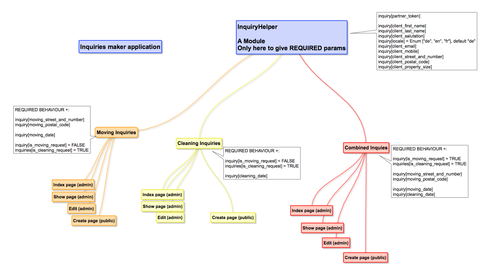

Inquiries Maker
================

Issues?
-----------

No issues yet.

Ruby on Rails
-------------

This application requires:

- Ruby 2.5.1
- Rails 5.2.0

Getting Started
---------------
### TODO:
- Web server for development? [passenger]
- Web server for production? [passenger]
- Database used in development? [mysql]
- Template engine? [slim]
- Test framework? [rspec]
- Continuous testing? [guard]
- Front-end framework? [bootstrap4]
- Add support for sending email? [smtp]
- Authentication? [ ]
- Devise modules? [ ]
- OmniAuth provider? [ ]
- Authorization? [ ]
- Use a form builder gem? [ ]
- Set a locale? [en]
- Install page-view analytics? [ga]
- Add a deployment mechanism? [capistrano3]
- Set a robots.txt file to ban spiders? [true]
- Create a GitHub repository? [true]
- Add gem and file for environment variables? [foreman]
- Improve error reporting with 'better_errors' during development? [true]
- Use 'pry' as console replacement during development and test? [true]

Documentation and Support
-------------------------

Issues
-------------

Similar Projects
----------------

Contributing
------------

Credits
-------

License
-------
